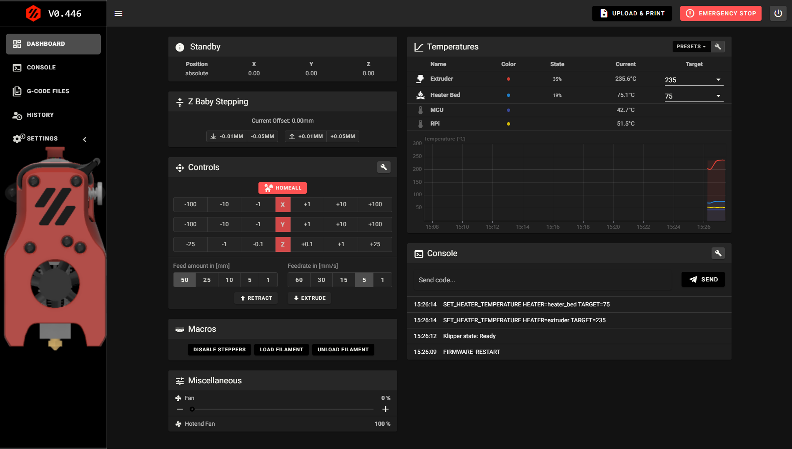
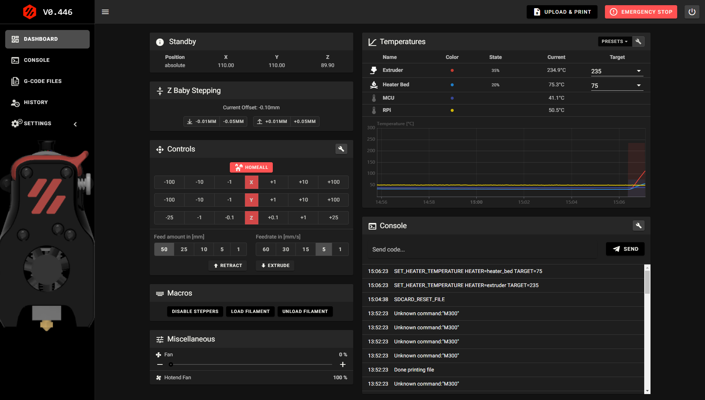
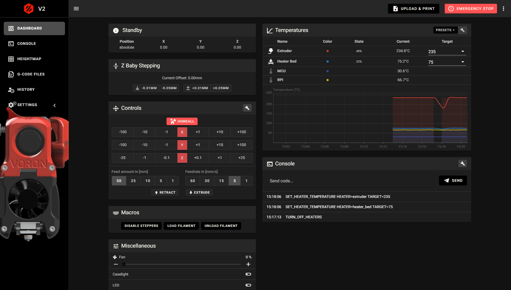
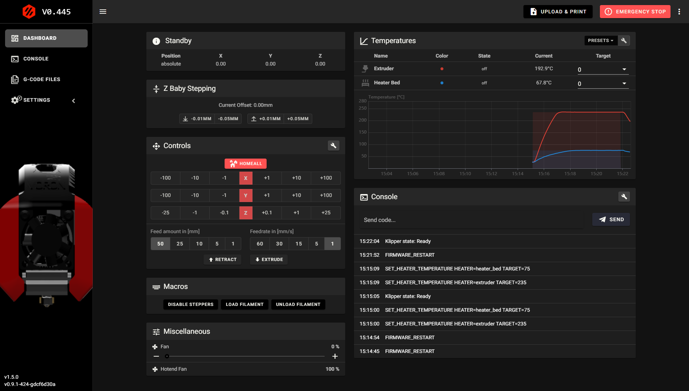
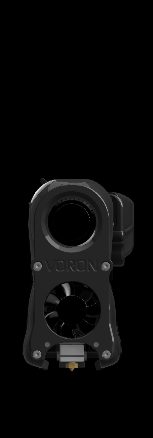
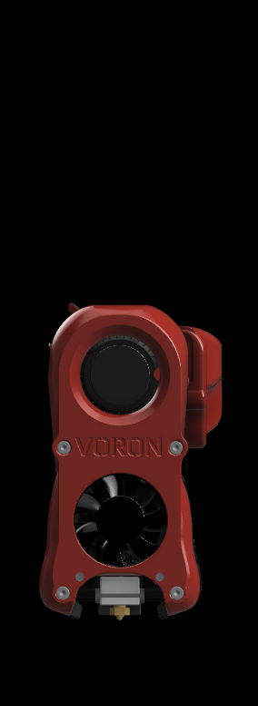
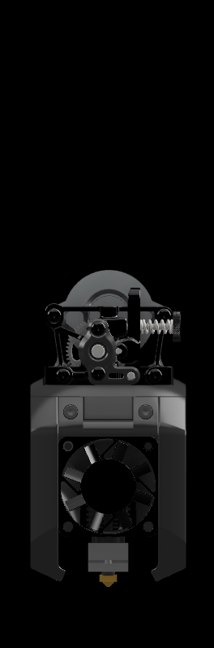
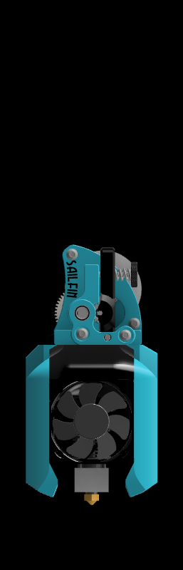
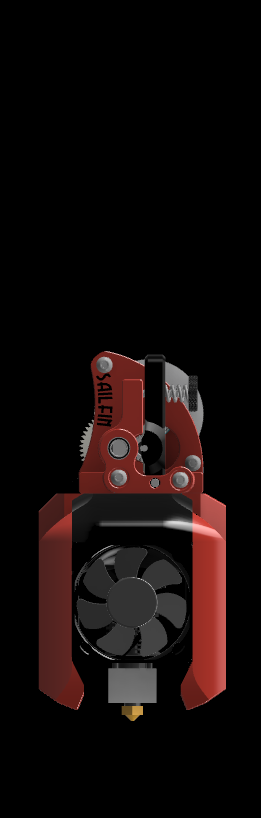

# Mainsail x Voron Toolhead Theme

A dark theme for mainsail including Voron toolheads and Voron accent colors (Black & Red) 

Download the desired toolhead and follow the instructions as per the [Mainsail Theming Guide](https://docs.mainsail.xyz/theming)

Alternatively, start by downloading toolhead, custom.css, favicons as well as the sidebar-logo and begin to place them in a folder named ".theme" within Mainsail's built-in file manager. 

Thanks to **th33xitus**, it's now possible to install this theme using [Kiauh](https://github.com/th33xitus/kiauh). Upon installation, download the desired toolhead from the sidebar-toolheads directory within the .theme folder and upload it into the main directory of the .theme folder. Then rename the image "sidebar-background.png". 

*PLEASE KEEP IN MIND THAT THE VARIOUS TOOLHEAD IMAGES MUST BE RENAMED TO "sidebar-background.png"*

#### Mainsail x Miniafterburner Red

#### Mainsail x Miniafterburner Black

   

#### Mainsail x Afterburner

#### Mainsail x V0.0 Toolhead

#### Some of the other Voron Toolheads include AB-BN-30, TinyM with Sherpa mini and Sailfin extruders. 

The Toolhead sidebar-backgrounds may be used without the custom.css, favicons and side bar-logo which will keep Mainsail in it's beautiful original color scheme.

###### Browser cache may have to be cleared after adding all desired files to the .theme folder. 
